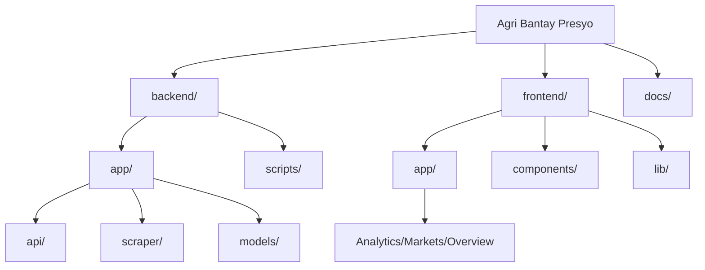

# Project Directory Structure

This document outlines the folder structure for the **Agri Bantay Presyo** project. The backend structure adheres to the official FastAPI best practices for scalable applications (often referred to as the "Title Project Structure").
    


## Root Directory
```
/
├── backend/               # FastAPI Backend
│   ├── app/
│   │   ├── api/           # API Route Definitions
│   │   ├── core/          # Core Config (Settings, Security)
│   │   ├── db/            # Database Connection & Bases
│   │   ├── models/        # SQLAlchemy ORM Models
│   │   ├── schemas/       # Pydantic Schemas (Request/Response)
│   │   ├── services/      # Business Logic (CRUD, etc.)
│   │   ├── scraper/       # PDF Extraction Logic (Gemini AI)
│   │   └── main.py        # App Entry Point
│   ├── scripts/           # Standalone Scripts (Backfill, Utilities)
│   └── tests/             # Pytest Tests
├── frontend/              # Next.js Frontend
│   ├── app/               # App Router Pages (Analytics, Markets, etc.)
│   ├── components/        # Reusable UI Components
│   └── lib/               # Utilities & API Clients
└── docs/                  # Project Documentation
```

## detailed Backend Breakdown (`/backend`)

| Directory | Purpose |
| :--- | :--- |
| `app/main.py` | The entry point of the application. Initializes the `FastAPI` app instance. |
| `app/api/` | Contains all API route handlers. |
| `app/api/v1/endpoints/` | Specific versioned endpoints (e.g., `prices.py`, `commodities.py`). |
| `app/core/` | Configuration files (e.g., `config.py` for env vars, security settings). |
| `app/db/` | Database setup. `session.py` (engine creation), `base.py` (SQLAlchemy base). |
| `app/models/` | **DB Tables**. SQLAlchemy models representing database tables (e.g., `Commodity`, `Market`). |
| `app/schemas/` | **Data Validation**. Pydantic models for API request/response bodies (e.g., `CommodityCreate`, `PriceOut`). |
| `app/services/` | Reusable business logic separate from routes. |
| `app/scraper/` | **AI Parser**. Logic for processing PDFs using Google Gemini AI (`parser_engine.py`). |
| `scripts/` | **Utilities**. Standalone scripts for one-off tasks like `process_backfill.py`. |
| `tests/` | Unit and integration tests. Mirrors the `app` structure. |

## Detailed Frontend Breakdown (`/frontend`)

| Directory | Purpose |
| :--- | :--- |
| `app/` | **App Router**. Contains page definitions (`page.tsx`) and layouts (`layout.tsx`). |
| `app/analytics/` | **Analytics Page**. Deep dive charts and historical data visualization. |
| `app/markets/` | **Market Hub**. Searchable table of all live market prices. |
| `components/` | **UI Components**. Reusable React components (e.g., `PriceChart`, `Navbar`). |
| `lib/` | **Logic**. API clients (`api.ts`) and utility functions. |

## Key FastAPI Patterns Used
*   **Separation of Concerns:** Routes (`api`) are separate from database models (`models`) and validation schemas (`schemas`).
*   **Dependency Injection:** Database sessions and settings are injected into routes.
*   **Versioned APIs:** `api/v1` allows for future updates without breaking existing clients.
