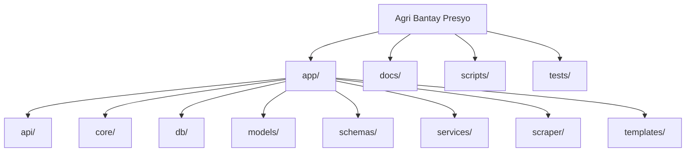

# Project Directory Structure

This document outlines the folder structure for the **Agri Bantay Presyo** project. The structure follows FastAPI best practices with a flat layout.



## Root Directory
```
/
├── app/                    # FastAPI Application
│   ├── api/                # API Route Definitions
│   │   ├── views.py        # Jinja2 template views (Home, Markets, Analytics)
│   │   └── v1/             # API endpoints
│   ├── core/               # Core Config (Settings, Security)
│   ├── db/                 # Database Connection & Bases
│   ├── models/             # SQLAlchemy ORM Models
│   ├── schemas/            # Pydantic Schemas (Request/Response)
│   ├── services/           # Business Logic (CRUD, etc.)
│   ├── scraper/            # PDF Extraction Logic (Gemini AI)
│   ├── templates/          # Jinja2 Templates (Home, Markets, Analytics)
│   ├── static/             # Static assets
│   └── main.py             # App Entry Point
├── scripts/                # Standalone Scripts (Backfill, Utilities)
├── tests/                  # Pytest Tests
├── alembic/                # Database migrations
├── data/                   # Data storage
├── downloads/              # PDF downloads
├── docs/                   # Project Documentation
├── Dockerfile              # Container configuration
├── docker-compose.yml      # Docker orchestration
├── requirements.txt        # Python dependencies
└── alembic.ini             # Alembic configuration
```

## Detailed App Breakdown (`/app`)

| Directory | Purpose |
| :--- | :--- |
| `main.py` | The entry point of the application. Initializes the `FastAPI` app instance. |
| `api/` | Contains all API route handlers and template views. |
| `api/views.py` | **Template Views**. Jinja2-rendered pages (Home, Markets, Analytics). |
| `api/v1/endpoints/` | Specific API versioned endpoints (e.g., `prices.py`, `commodities.py`). |
| `core/` | Configuration files (e.g., `config.py` for env vars, security settings). |
| `db/` | Database setup. `session.py` (engine creation), `base.py` (SQLAlchemy base). |
| `models/` | **DB Tables**. SQLAlchemy models representing database tables (e.g., `Commodity`, `Market`). |
| `schemas/` | **Data Validation**. Pydantic models for API request/response bodies. |
| `services/` | Reusable business logic separate from routes. |
| `scraper/` | **AI Parser**. Logic for processing PDFs using Google Gemini AI. |
| `templates/` | **Jinja2 Templates**. Server-rendered HTML pages. |
| `static/` | Static files (CSS, JS, images). |

## Key FastAPI Patterns Used

*   **Separation of Concerns:** Routes (`api`) are separate from database models (`models`) and validation schemas (`schemas`).
*   **Dependency Injection:** Database sessions and settings are injected into routes.
*   **Versioned APIs:** `api/v1` allows for future updates without breaking existing clients.
*   **Template Views:** Server-rendered pages using Jinja2 with Alpine.js and HTMX for interactivity.
