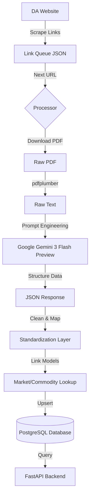

# Technical Architecture & Scraper Logic
**Project:** Agri Bantay Presyo

## Recommended Tech Stack (The "Agri-Stack")
*   **Backend API:** FastAPI (Python) - High performance; async support for concurrent scraping.
*   **Database:** PostgreSQL - Relational data (linking Commodities to Markets).
*   **AI Engine:** Google Gemini 3 Flash Preview - For intelligent, schema-aware parsing of unstructured PDF tables.
*   **Frontend:** Next.js (React) - Fast, client-side interactive dashboard.

## Scraper & Data Ingestion Logic
1.  **Source Acquisition**: The system scrapes the Department of Agriculture website for "Price Watch" and "Daily Retail Price" PDF links.
2.  **Queue Management**: Links are filtered and added to a processing queue (persisted in JSON) to track backfill progress.
3.  **AI-Powered Parsing**:
    *   PDF text is extracted using `pdfplumber` (giving better layout preservation).
    *   Raw text is sent to **Google Gemini 3 Flash Preview** with a strict schema prompt.
    *   Gemini returns a clean JSON array of pricing entries, handling column misalignments and layout changes automatically.
4.  **Standardization**: Extracted names (e.g., "Red Onion", "Onion Red") are normalized to a canonical `Commodity` ID using a smart lookup strategy (Exact Match -> Category Match -> Partial Match).
5.  **Persistence**: Validated data is upserted into the `PriceEntry` table, linked to `Commodity` and `Market` models.
6.  **Historical Backfill**: A dedicated script (`process_backfill.py`) sequentially processes years of historical reports (2018-Present).

### Scraper Workflow Diagram

