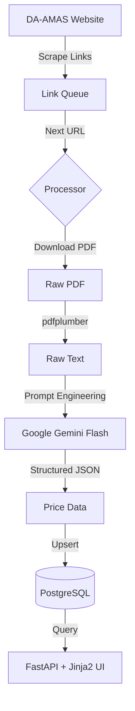

# Technical Architecture & Scraper Logic
**Project:** Agri Bantay Presyo (Daily Retail Price Monitoring)

## Tech Stack
*   **Backend API:** FastAPI (Python) - High performance; async support.
*   **Database:** PostgreSQL - Relational data storage.
*   **AI Engine:** Google Gemini Flash - For intelligent PDF table parsing.
*   **Frontend:** Jinja2 Templates + Tailwind CSS + Alpine.js + HTMX.

## Scraper & Data Ingestion Logic

1.  **Source Acquisition**: The system scrapes the DA-AMAS website for Daily Retail Price Range PDF links.
2.  **Queue Management**: Links are tracked to avoid duplicate processing.
3.  **AI-Powered Parsing**:
    *   PDF text is extracted using `pdfplumber`.
    *   Raw text is sent to **Google Gemini** with a structured prompt.
    *   Gemini returns clean JSON with price ranges (low/high/prevailing).
4.  **Persistence**: Data is upserted into the `PriceEntry` table.
5.  **Automation**: Celery tasks run daily to check for new reports.

### Scraper Workflow Diagram

## What's Included
- Daily Retail Price Range PDF parsing
- Basic commodity/market storage
- Interactive dashboard
- REST API endpoints

## What's NOT Included (v2.0)
- Weekly Average PDF parsing
- Supply Index tracking
- Complex commodity standardization
